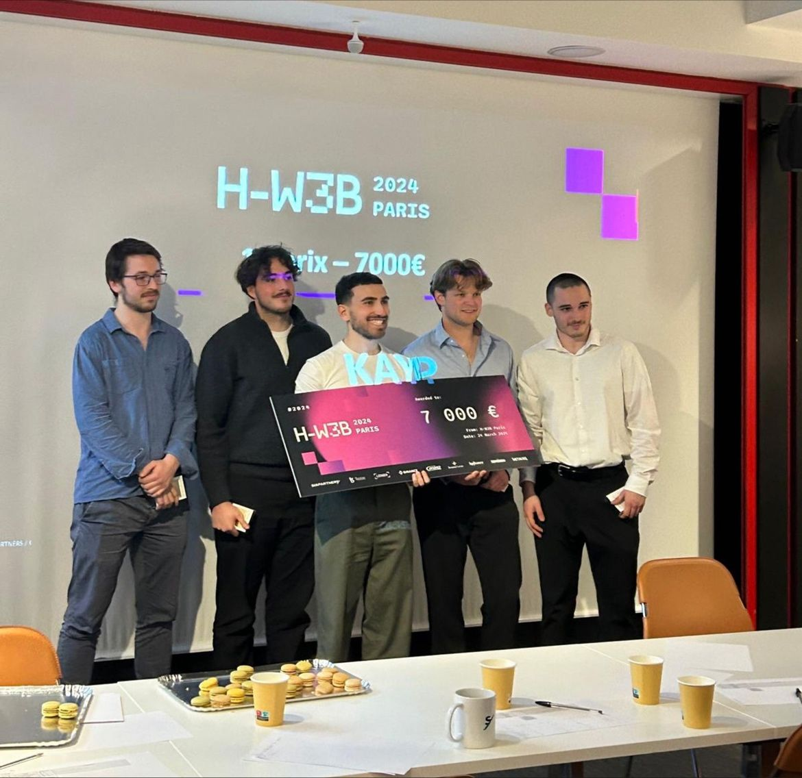

# Team

**KAYP** is powered by a dedicated team of five passionate individuals committed to innovating the shipping and logistics industry.

## Hugo Deiss - Chief Executive Officer (CEO)

Hugo is the visionary founder of KAYP. His innovative idea for streamlining electronic Bills of Lading sparked the creation of the platform. With a strong background in logistics and a keen eye for industry needs, Hugo leads the team with strategic direction and forward-thinking leadership.

## Théo Cerdan - Chief Technology Officer (CTO)

As the CTO, Théo oversees all technological developments at KAYP. A graduate of École 42 Lyon, he brings extensive expertise in software development and system architecture. Théo ensures that KAYP stays at the forefront of technological innovation, delivering robust and scalable solutions.

## Valentin Gonnot – Software Engineer

Valentin is a skilled developer from École 42 Lyon who plays a crucial role in building and refining the KAYP platform. His proficiency in coding and problem-solving contributes significantly to the platform's functionality and user experience.

## Jocelyn Renault - Software Engineer

Also hailing from École 42 Lyon, Jocelyn specializes in software engineering and contributes to the development of KAYP's core features. His attention to detail and commitment to excellence help maintain the platform's high standards.

## Lucas Compiègne - Software Engineer

Lucas is a talented software engineer from École 42 Lyon who adds valuable expertise to the team. His focus on innovation and efficiency aids in advancing KAYP's technological capabilities.

---

# Our Story

The team came together during the **H-W3B hackathon** in Paris, where they collaborated on Hugo's groundbreaking idea for KAYP. Their synergy and combined expertise led them to win the hackathon, validating the potential of their concept. Motivated by this success, they decided to continue their journey together, dedicating themselves to transforming the shipping industry through technology.

