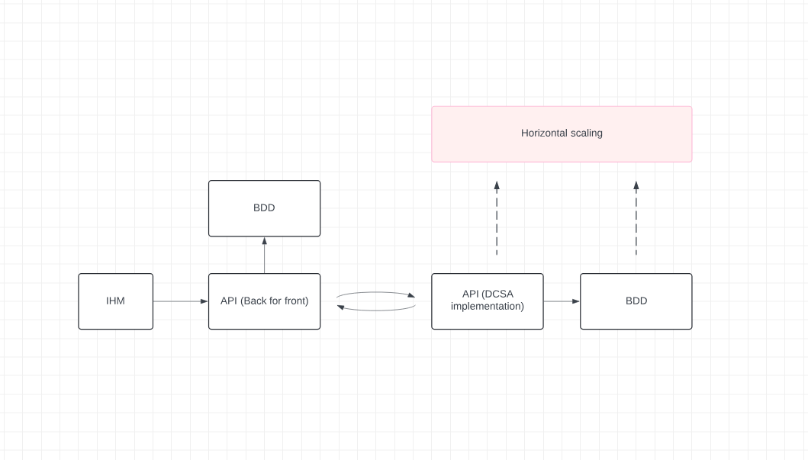

# Architecture

The architecture of KAYP is designed to ensure scalability, security, and compliance with DCSA standards. This documentation outlines the key components of the architecture, emphasizing how different parts interact and secure the exchange of sensitive shipping data.

## Overview

KAYP's architecture is relatively simple, yet powerful, and consists of three main elements:

1. **Frontend**: A client-facing application built with **React.js**.
2. **Back for Front API**: A backend service built using **Java Spring**, designed to serve the frontend and handle its specific API needs.
3. **DCSA-Compliant API**: Another backend service, also implemented in **Java Spring**, that adheres to the **DCSA standards**. This service is the heart of the interaction with the blockchain.

These components are linked together and communicate with **SQL databases** and **blockchain technology** to ensure secure, decentralized data management. Below, we dive deeper into each of these layers and explain how they interact.

---

## Components Breakdown

### 1. **Frontend (React.js)**

The frontend is built using **React.js**, which provides a dynamic and responsive user interface. The frontend interacts with the backend through the **Back for Front API**, making API calls to fetch and submit the necessary data. It is a decoupled architecture, where the frontend doesn't directly communicate with the DCSA-compliant API but relies on the intermediate Back for Front API.

### 2. **Back for Front API (Java Spring)**

The **Back for Front API** is designed as an intermediary between the frontend and the DCSA-compliant backend. Developed with **Java Spring**, this layer abstracts the complexities of interacting with the DCSA-compliant API and simplifies the data sent back to the frontend.

#### Key responsibilities:
- Acts as a **gateway** for all frontend requests.
- **Validates and processes** frontend data.
- Queries its own **SQL database** for frontend-specific information.
- Communicates with the **DCSA-compliant API** to handle business logic such as managing shipments, creating electronic Bills of Lading (eB/L), and tracking data.

The Back for Front API is critical in ensuring the separation of concerns, keeping frontend logic light and the backend processing powerful and compliant with DCSA standards.

### 3. **DCSA-Compliant API (Java Spring)**

The **DCSA-compliant API** is the core service responsible for managing key shipping processes and handling sensitive data interactions. This service is also built using **Java Spring** and is highly scalable, capable of being **horizontally scaled** to meet increasing demand.

#### Key features:
- **Complies with DCSA standards** for electronic Bills of Lading (eB/L) and shipping information.
- Communicates directly with the **blockchain** for securing key shipping data.
- Handles its own **SQL database**, which stores shipping and transaction information.
- The **hash** of the Bill of Lading (with an initialization vector) is **stored on the blockchain**, ensuring the privacy of the data. No **clear data** is exposed on the blockchain, only cryptographic representations (hashes) of the Bill of Lading.

### 4. **Database Architecture**

The system uses **two SQL databases** to manage data storage:

- **Frontend SQL Database**: Dedicated to storing data specific to the frontend needs. This includes user session data, temporary states, and other non-critical information.

- **DCSA-Compliant API SQL Database**: Stores all data related to shipping transactions, Bills of Lading, and other key logistics data. It ensures that the sensitive shipping data handled by the DCSA-compliant API is properly organized and secure.

### 5. **Blockchain Interaction**

One of the key innovations of KAYP is the interaction with the **blockchain**. The **hash** of the Bill of Lading (eB/L) is stored on the blockchain to ensure **data integrity and non-repudiation**. This hash includes a **vector of initialization**, ensuring that even the hash itself cannot be used to retrieve any clear data.

- **No clear data** (e.g., customer details, shipment specifics) is ever stored on the blockchain. Only cryptographic data (i.e., the hash of the Bill of Lading) is stored.
- This ensures that sensitive information remains **protected** while still leveraging the immutability and decentralized nature of blockchain technology.

The integration of blockchain provides an added layer of trust, particularly in industries where tamper-proof records are crucial.

---

## Privacy and Data Protection

KAYP’s architecture is designed with **privacy** in mind. By storing only **hashes** on the blockchain, the system ensures that no sensitive or personally identifiable information (PII) is exposed. This approach complies with international **data protection laws** (e.g., GDPR) while still leveraging blockchain's security benefits.

Additionally, the DCSA-compliant API can be **self-hosted**, allowing organizations to maintain full control over their data, ensuring that they can comply with regional privacy regulations and customize their security protocols to meet specific needs.

---

## Architecture Diagram

---

## Conclusion

KAYP’s architecture provides a secure, scalable, and privacy-focused solution for managing sensitive shipping data. By separating concerns between the frontend, Back for Front API, and the DCSA-compliant API, and by utilizing blockchain technology for the cryptographic storage of Bills of Lading, KAYP ensures that your shipping operations are efficient, compliant, and secure.

For more information on how to self-host the KAYP API or interact with the blockchain, please refer to our **developer documentation** or contact our support team.
